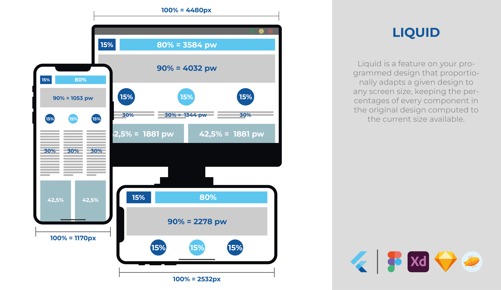
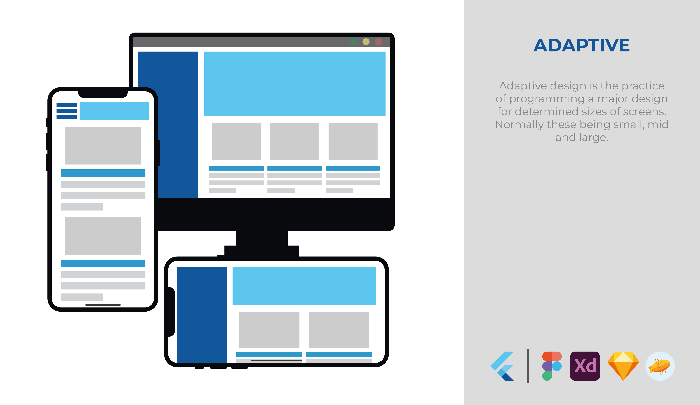

# Full Responsive

> [Responsive design](https://developer.mozilla.org/en-US/docs/Learn/CSS/CSS_layout/Responsive_Design#responsive_design) = [Fluid design](https://blog.hubspot.com/website/fluid-design) + [Adaptive design](https://www.invisionapp.com/defined/adaptive-design)

The final solution for a _full responsive_ design. With this package you will easily program liquid/fluid designs as well as adaptive designs from your design solution (Figma/Zepplin/etc) to your app in the most straightforward way possible.

## Demo


### Fluid design


On fluid (or liquid) designs, you lay out widgets defining with proportions their sizes. 
### Adaptive design

On adaptive design you program a specific UI for every screen size

## How to use

In `pubspec.yaml` add:
```yaml
dependencies:
  full_responsive: ^0.0.1

dev_dependencies:
  build_runner: ^2.2.0

full_responsive:
# Define the resolutions to be supported globally
# The source generator builder will get this info for building ad-hoc widgets for your app
  resolutions:
    - name: "mobile"
      width: 378
      height: 812
    - name: "tablet"
      width: 1024
      height: 1350
      nullable: true
```

How to build afterwards:
> flutter pub run build_runner build --delete-conflicting-outputs #single build  
> flutter pub run build_runner watch --delete-conflicting-outputs #smart continuous rebuilding

Define in your app this
```dart
import 'package:example/src/full_responsive/full_responsive_app.g.dart';

main(){
    runApp(
        FullResponsiveApp(
            child: MaterialApp(/* ... */),
        )
    );
}
```
For every screen your app has, define:
```dart
import 'package:example/src/full_responsive/full_responsive_screen.g.dart';

class ScreenFoo extends StatelesWidget{
    @override
    Widget build(BuildContext context){
        return FullResponsiveScreen(
            // widget to render when the current screen size is lower to 812px
            mobile: _MobileDesign(),
            // widget to render when the current screen size is greater to 812px
            // this could be null, in which case the rendered widget would be [_MobileDesign]
            tablet: _TabletDesign()
        );
    }
}
```

## Working logic
_full_responsive_ is highly configurable and will handle your UI accordingly. You first define the resolutions that your app should support. When the screens detects layout changes the proper resolution will be loaded if it exists, or fail if it's missing and the resolution is not nullable, or keep the lower resolution (as this package is mobile-first).

## Measurements
When you program your UI you should make use of the following prefixes on the numbers for providing the liquid/fluid behavior:

### .pw/.proportionalWidth | .ph/.proportionalHeight - Proportional Width/Height
The prefixed number will be converted to a percentage of the parent Resolution and then applied to the size of the screen.  
e.g.  
Given `Resolution(1000,500)` and `SizedBox(width: 200.pw, height: 250.ph)` the processed SizedBox will vary on the current screen dimensions:  


| screen size | SizedBox dimensions |
|-------------|----------------------
| 2000x1000 | SizedBox(width: 400, height: 500) |
| 500x250 | SizedBox(width: 100, height: 125) |

### .sw/.staticWidth | .sh/.staticHeight - Static Width/Height
Sometimes you want some measures to be maintained statically, for that purpose it's recommended you use this placeholders, that don't compute anything but maintains the consistency of the code and avoids lints that suggest you to use this measurements.
e.g.  
Given `Resolution(1000,500)` and `SizedBox(width: 200.pw, height: 250.ph)` the processed SizedBox will vary on the current screen dimensions:  


| screen size | SizedBox dimensions |
|-------------|----------------------
| 2000x1000 | SizedBox(width: 200, height: 250) |
| 500x250 | SizedBox(width: 200, height: 250) |

## .pf - Proportional Font Size
Syntactic sugar for applying the same logic of .pw but for fonts (use always this approach though: maybe in a future the algorithm changes)

## .sf - Static Font Size
Syntactic sugar for applying the same logic of .sw but for fonts (use always this approach though: maybe in a future the algorithm changes)

## .wp/.widthPercentage | .hp/.heightPercentage - Width/Height Percentage
The given number as the percentage of the screen's height/width. (must be between 0 & 100)  
e.g.  
Given `Resolution(1000,500)` and `SizedBox(width: 20.wp, height: 25.hp)` the processed SizedBox will vary on the current screen dimensions:  


| screen size | SizedBox dimensions |
|-------------|----------------------
| 2000x1000 | SizedBox(width: 400, height: 250) |
| 500x200 | SizedBox(width: 100, height: 50) |

## Design resolution sizes advice.

When you design it's a good practice to take in consideration [the most popular resolutions used](https://gs.statcounter.com/screen-resolution-stats/desktop/worldwide) as well as the [IOS device sizes](https://www.ios-resolution.com/). For that we suggest you use one of the following sizes:
 - small: **390x844**
 - medium: **1024x768**
 - big: **1920x1080**

 ### _full_responsive_ roadmap

  - [x] liquid measurements
  - [x] adaptive designs auto-loading
  - [x] pubspec.yaml's full_responsive: support
  - [x] build_runner builder
  - [x] landscape/portrait automatic lock support

  Shared Widget approach helpers:
  - [ ] `frv(12.pw,30.pw,60.pw)` -> `fullResponsiveValue(mobile: 12.pw, tablet: 30.pw, computer: 60.pw)` function generator
  - [ ] `frv()` customizer on settings
  - [ ] enums generators `enum Resolution {mobile, tablet}`
  - `FullResponsiveState` class with current resolution values (maxWidth, current resolution enum, bottomInsets for keyboard and so, etc...)

  Luxury features:
  - [ ] analyzer linters
  - [ ] Analysis server plugin
  - [ ] FullResponsiveScreen's onScreenChanged() argument (ideal for analytics)
  - [ ] FullResponsiveScreen single child on widget tree check
  - [ ] Mason's generator for screens
  - [ ] Improve redrawing logic: instead of marking all children for rebuild, mark just the ones with liquid measurements usage through an extension to Widget or sth that works
  - [ ] full_responsive.yaml support (low prio/won't do)
  - [ ] Find a way of omitting Base classes from code suggestions (low prio)
  - [ ] move templates to .mustache files (veeery low prio)
  - [ ] full_responsive.yaml features (with good docs):
    - [x] nullable: support
    - [x] width: (width) & height: (height) support
    - [ ] name: deprecation
    - [ ] size: (width)x(height) support
    - [ ] landscape: true support (very low prio)
  